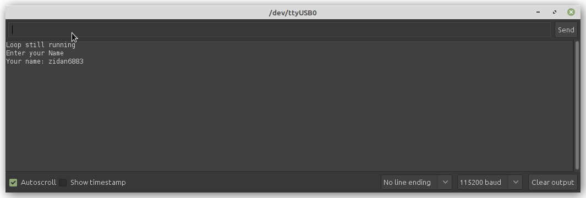
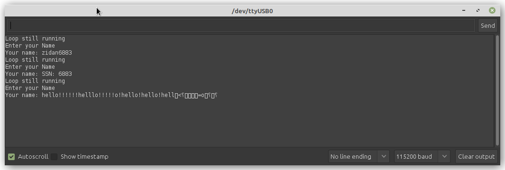

# Jak to vzniklo

V rámci  předmětu AP8BO jsem si vylosoval příklad buffer overflow na mikrokontroléru.
Nebudu hrát formu, našel jsem si na internetu nějaký funkční návod, jak na to. Ve výsledku
jsem schopný dumpovat věci z paměti pomocí terminálu.

***Zdroje:***
- [Example 1](https://hackaday.io/project/174909-simple-security-risk-examples-on-arduino/log/183801-example-1-simple-buffer-overflow)
- [Example 2](https://hackaday.io/project/174909-simple-security-risk-examples-on-arduino/log/183803-example-2-stack-data-access)
- [Example 3](https://hackaday.io/project/174909-simple-security-risk-examples-on-arduino/log/183805-example-3-buffer-overflow-with-function-pointers)

## Jak to pak vypadá?
_Nemazal jsem paměť, takže to zvrací ještě věci, co tam zůstaly ze starých pokusů (proto sekvence hello!!!!!)_

### Proč se to děje?
V programu máme funkci **process\_secret_data**, tato funkce v našem příkladu zprostředkovává nějakou tajnou informaci. Zpravidla v ní může být uložený nějaký pass string, nebo tak něco.

Problémem je pak to, že ve vyrovnávací paměti **do\_something_else** není ošetřeno přemazání bufferu v momentě, kdy funkce končí. To má pak ten následek to, že uložená data jsou zpravidla ukládána na navzájem blízké adresy, takže pokud donutíme buffer sahat na jinou adresu, například **!**, tak přeteče a tiskne na výstup vše, než najde **\n**
